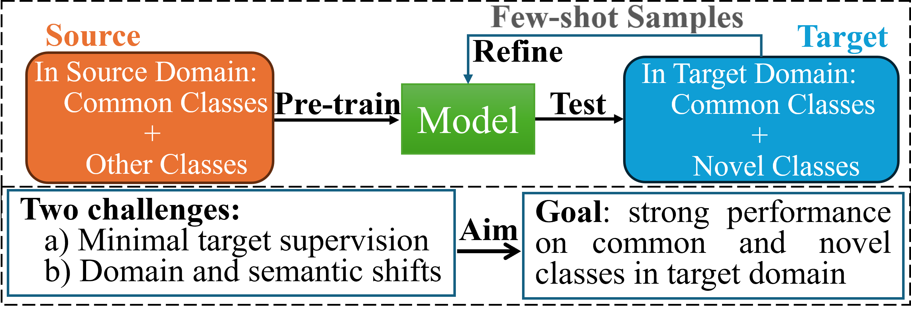
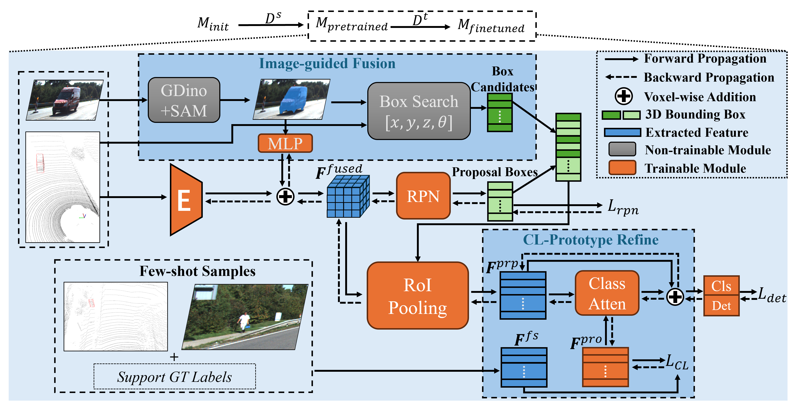

# [Paper Title]: From Dataset to Real-world: General 3D Object Detection via Generalized Cross-domain Few-shot Learning


[](https://arxiv.org/abs/2503.06282)
[](LICENSE)

This repository contains the official implementation of the paper: **"From Dataset to Real-world: General 3D Object Detection via Generalized Cross-domain Few-shot Learning"**. The extension of the paper is public accessabl in [arXiv](https://img.shields.io/badge/arXiv-23XX.XXXXX-b31b1b.svg).

LiDAR-based 3D object detection models often struggle to generalize to real-world environments due to limited object diversity in existing datasets. To tackle it, we introduce the first **generalized cross-domain few-shot (GCFS)** task in 3D object detection, aiming to adapt a source-pretrained model to both common and novel classes in a new domain with only few-shot annotations. Accordingly, we propose a unified framework that learns stable target semantics under limited supervision by bridging 2D open-set semantics with 3D spatial reasoning, by corporating the image-guided multi-modal fusion and contrastive-enhanced prototype learning.


## 📰 News
* **[2026-01-07]**: Code and GCFS benchmark protocols are released.

---

&ensp;
## 🛠️ Installation

Both the benchmark evaluation and the proposed method share the same environment.
👉 **[📄 Click here for Dataset Installation Guide](docs/INSTALL.md)**

&ensp;
## 🎯 The GCFS Benchmark

We construct a comprehensive benchmark to evaluate Generalized Cross-domain Few-shot (GCFS) performance across various autonomous driving datasets.

### 1. Benchmark Framework
The following diagram illustrates our benchmarking pipeline, encompassing source domain pre-training and target domain few-shot adaptation.

<div align="center">
  
  <em>Figure: The GCFS Task</em>
</div>

### 2. Dataset Preparation
We utilize five major autonomous driving datasets. Due to the complexity of data preprocessing, please refer to our detailed documentation for download links, folder structures, and preprocessing scripts.

👉 **[📄 Click here for Dataset Preparation Guide](docs/DATASET_PREPARATION.md)**

*Included Datasets:* nuScenes, Waymo Open Dataset, KITTI, A2D2, Argoverse2. 

### 3. Benchmarking Settings
We design four distinct cross-domain transfer protocols to assess model robustness under realistic domain shifts and novel objects.

| Protocol ID | Source Domain ($D_s$) | Target Domain ($D_t$) |
| :---: | :--- | :--- | 
| **P1** | NuScenes | **FS-KITTI** | 
| **P2** | Waymo | **FS-KITTI** |
| **P3** | KITTI | **FS-A2D2** |
| **P4** | KITTI | **FS-Argo2** | 

*> **FS-**: Denotes the Few-Shot setting where only K-shot objects in limite frames are available in the target domain transfering.*

### 4. Metrics
Following standard practices in 3D object detection, we primarily use **3D Average Precision (3D AP)** to evaluate performance.

&ensp;
## 🧠 Proposed Method: GCFS

### 1. Method Overview & Framework
We propose a unified framework that learns stable target semantics under limited supervision by bridging 2D open-set semantics with 3D spatial reasoning. Specifically, an **image-guided multi-modal fusion** injects transferable 2D semantic cues into the 3D pipeline via vision-language models, while a physically-aware box search enhances 2D-to-3D alignment via LiDAR priors. To capture class-specific semantics from sparse data, we further introduce **contrastive-enhanced prototype learning**, which encodes few-shot instances into discriminative semantic anchors and stabilizes representation learning.


<div align="center">
  
  <br>
  <em>Figure: The overall architecture of our proposed GCFS method.</em>
</div>

### 2. Training and Testing
We provide scripts for both training and evaluation (e.g., NuScenes → FS-KITTI, 5-shot). 

#### Pre-training
Pre-train the model on the source domain:

```bash
python train_multi_db_concat.py --cfg ./cfgs/FS-DA/nusc_to_fs_kitti/voxelrcnn/nusc_base/voxel_rcnn_nusc_common_cls.yaml --batch_size 2
```

#### Meta-training
Run MAML-based Meta-training on the source domain:

```bash
python train_multi_db_META_2Loaders.py --cfg ./cfgs/FS-DA/nusc_to_fs_kitti/voxelrcnn/nusc_meta/voxel_rcnn_ClsPro_META.yaml --batch_size 2 --batch_size_sup 2 --batch_META_use --epochs 5  --pretrained_model ${PATH TO Pre-trained CKPT}.pth

```

#### Target (Few-shot) Training
Train models with few-shot samples on the target domain, including simple finetuning or our GCFS finetuning: 
```bash
# simple-FT
python train_multi_db_concat.py --cfg ./cfgs/FS-DA/nusc_to_fs_kitti/voxelrcnn/kitti_finetune/voxel_rcnn_simple_FT.yaml --batch_size 1 --pretrained_model ${PATH TO Meta-trained CKPT}.pth

# GCFS-FT
python train_multi_db_META_2Loaders.py --cfg ./cfgs/FS-DA/nusc_to_fs_kitti/voxelrcnn/kitti_finetune/voxel_rcnn_IMMF_ClsPro_FT.yaml --batch_size 1 --batch_size_sup 10 --epochs 100 --pretrained_model ${PATH TO Meta-trained CKPT}.pth
```

#### Target Testing
Evaluation models on the target domain:
```bash
python test.py --cfg ./cfgs/FS-DA/nusc_to_fs_kitti/voxelrcnn/kitti_finetune/voxel_rcnn_IMMF_ClsPro_FT.yaml --batch_size 1 --db_tes 3 --ckpt ${PATH TO FS-trained CKPT}.pth
```

### Model Zoo: 

Due to [Waymo Dataset License Agreement](https://waymo.com/open/terms/), we could not provide the Waymo-related pretrained models, but you could easily achieve similar performance by training with the corresponding configs. Regarding the other pretrained models, you can find them in [`pretrained models`](https://drive.google.com/drive/folders/1PXO1qAzUWOcf_JreTnMF1jINY1gAleJ4?usp=sharing) and easily reproduce the performance in the paper.


&ensp;
## Acknowledge
* Our code is heavily based on [OpenPCDet](https://github.com/open-mmlab/OpenPCDet) and [3DTrans](https://github.com/PJLab-ADG/3DTrans). Thanks for their awesome codebases.


## Citation
If you find this project useful in your research, please consider citing:
```
@article{li2025dataset,
  title={From Dataset to Real-world: General 3D Object Detection via Generalized Cross-domain Few-shot Learning},
  author={Li, Shuangzhi and Shen, Junlong and Ma, Lei and Li, Xingyu},
  journal={arXiv preprint arXiv:2503.06282},
  year={2025}
}
```
